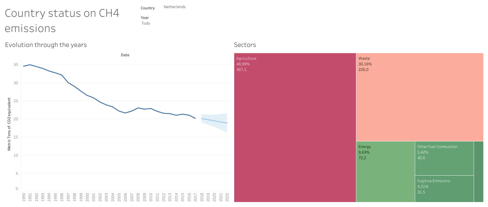

# Study of methane emissions

## Example

 
    
 
 

## Data

This dataset was obtained from [Kaggle](https://www.kaggle.com/datasets/kkhandekar/methane-emissions-across-the-world-19902018) and gives the amout of CH4 emitted across the world.

## Goal

The goal of this project is to _make the most out of this_ small dataset.

## Results

The results can be checked on Tableau Public. There are two dashboards.
- The [first](https://public.tableau.com/views/CountrystatusonCH4emissions/DashboardCountrystatus?:language=es-ES&:display_count=n&:origin=viz_share_link) one shows information by country.
- The [second](https://public.tableau.com/views/GlobalstatusonCH4emissions/DashboardGeneralstatus?:language=es-ES&:display_count=n&:origin=viz_share_link) dashboard gives a view of the global evolution.

## Development

Developed using the Anaconda environment.

- pandas
- matplotlib
- numpy